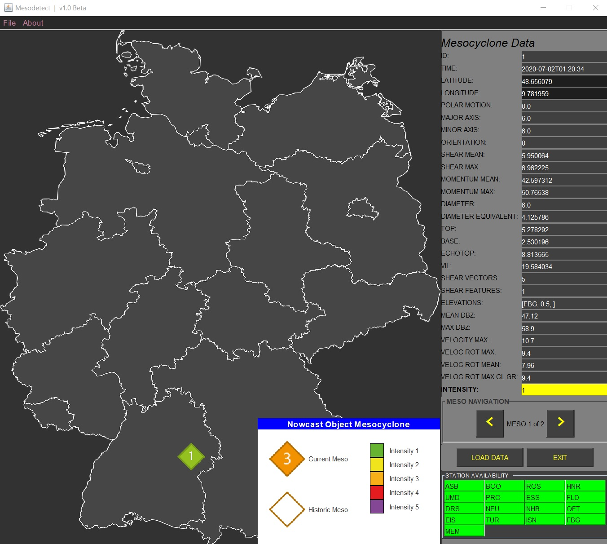

# mesodetect

## Moved to new Repository
This project moved to the following repository:

[Mecy-Information](https://github.com/buu-huu/mecy-information)

Mesodetect is a software that shows mesocyclones, located and detected by the weather radars from the german weather authority.

Since the application is in a very early development state, you can see a short preview picture:

